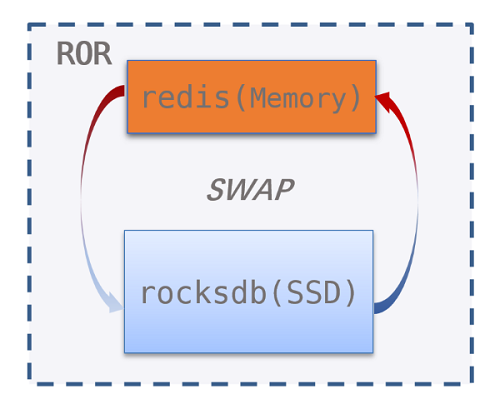
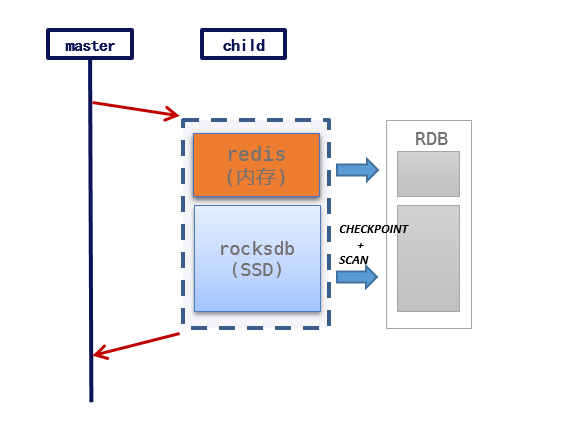

## Introduction

ROR is a more cost-effective alternative to redis, uses RocksDB as the storage engine and can save about 2/3 of the cost.

ROR extends SWAP feature based on redis codebase, it is compatible with almost all redis commands (including lua and multi/exec) and redis replication (RDB +RESP).

## Build

### prerequisites

1. ubuntu

```
apt install libsnappy-dev zlib1g-dev libgflags-dev libstdc++6
```

2. centos

```
yum install snappy zlib gflags libstdc++
```

### build

```
git clone https://github.com/ctripcorp/Redis-On-Rocks.git
git submodule upadate --init
cd redis
make
```

## Details

### SWAP

ROR stores hot and cold data in redis and RocksDB respectively, and exchanges hot and cold data automatically:

- SWAP IN: If key is cold, ROR reads cold key from RocksDB to redis, and then processes the command.
- SWAP OUT: If maxmemory is reached, ROR picks least frequently used key(LFU), and then writes the key to RocksDB.



### Replication

ROR replication process is almost the same with redis, the only difference lies in RDB generation for cold data: RocksDB CHECKPOINT is obtained first, and then the cold data is scanned and converted into RDB format.




